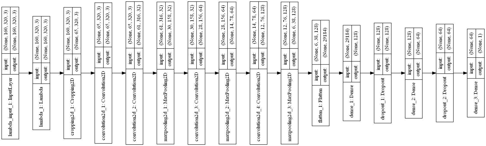

# Self-Driving Car Engineer Nanodegree
## Behavioral Cloning Project

The goals / steps of this project are the following:
* Use the simulator to collect data of good driving behavior
* Build, a convolution neural network in Keras that predicts steering angles from images
* Train and validate the model with a training and validation set
* Test that the model successfully drives around track one without leaving the road
* Summarize the results with a written report

### Files Submitted & Code Quality
#### 1. Submission includes all required files and can be used to run the simulator in autonomous mode
My project includes the following files:
* model.py containing the script to create and train the model
* drive.py for driving the car in autonomous mode
* model.h5 containing a trained convolution neural network 
* video.mp4 containing a video of car driving autonomously using the model. 
* writeup_report.md summarizing the results (this file)

#### 2. Submission includes functional code
Using the Udacity provided simulator and my drive.py file, the car can be driven autonomously around the track by executing 
```sh
python drive.py model.h5
```

#### 3. Submission code is usable and readable
The model.py file contains the code for training and saving the convolution neural network. The file shows the pipeline I used for training and validating the model, and it contains comments to explain how the code works.

### Model Architecture and Training Strategy
#### 1. An appropriate model architecture has been employed
My model starts with a lambda layer for normalizing the images centered around zero (model.py line 165). 
Then it has a cropping function to remove top 70 and bottom 25 pixels from the images because it contains noise. (model.py line 167)
Its followed by 3 1x1 filters to select the best color channel (model.py line 168).
Then there is a convolution neural network with 5x5/3x3 filter sizes and depths between 32 and 128 (model.py lines 170-177).
The model includes ELU layers to introduce nonlinearity. It also uses max pooling after every convolutional layer.
After the convolutions, there is a flatten layer and then three fully connected layers.
Each fully connected layer is followed by a dropout of probability 0.5.

#### 2. Attempts to reduce overfitting in the model
The model contains two dropout layers with 50% probability after fully connected layers in order to reduce overfitting (model.py lines 182, 185). 

The model was trained and validated on different data sets to ensure that the model was not overfitting (code line 152, 153, 193). The model was tested by running it through the simulator and ensuring that the vehicle could stay on the track.

#### 3. Model parameter tuning

The model used an adam optimizer, so the learning rate was not tuned manually (model.py line 189).

#### 4. Appropriate training data

Training data was chosen to keep the vehicle driving on the road. I started with udacity data set, which helped the model learn center lane driving. However since the car was going offtrack at a number of places I generated my own data recovering from the left and right sides of the road. I also filtered 70% of the data where steering was less than 0.1.

For details about how I created the training data, see the next section. 

### Model Architecture and Training Strategy
#### 1. Solution Design Approach

My first step was to use a model similar to LeNet (modified for regression) because I was familiar with it and I thought this model might be appropriate because it works well on image classification tasks.

In order to gauge how well the model was working, I split my image and steering angle data into a training (70%) and validation set (30%). I found that my first model had a low mean squared error on both the training set and the validation set but performed very poorly on the simulator.
I then started with a simpler model introduced in the lessons and gradually added convolutional layers. I received great help from this blog:
https://chatbotslife.com/using-augmentation-to-mimic-human-driving-496b569760a9#.szus4372m

The first layer is 3 1X1 filters, this has the effect of transforming the color space of the images and select the best channel, I got this tip from the above blog.
Then I added more convolutional layers with max pooling and ELU activation followed by fully connected layers until the training set loss was less than 0.02.
I used ELU activation instead of RELU because it was mentioned in the forums that ELU gives smoother steering.

However since the validation set loss was still slightly higher, so to combat overfitting, I modified the model to add dropout layers with 50% probability after each fully connected layer.

Then I trained the model with 6 epochs with a batch size of 128. For training I used the udacity AMI with GPUs on AWS.

The final step was to run the simulator to see how well the car was driving around track one. There were a few spots where the vehicle fell off the track. To improve the driving behavior in these cases, I generated my own recovery data from the simulator and appended it to the udacity dataset. Also I filtered 70% of the data where steering was less than 0.1

At the end of the process, the vehicle is able to drive autonomously around the track without leaving the road as seen in the video. 

#### 2. Final Model Architecture

The final model architecture (model.py lines 18-24) consisted of a convolution neural network with the following layers and layer sizes.

| Layer                          |     Output  Shape   | Params |
|:------------------------------:|:-------------------:|:------:|
| lambda_2 (Lambda)              | (None, 160, 320, 3) | 0      |
| cropping2d_2 (Cropping2D)      | (None, 65, 320, 3)  | 0      |
| convolution2d_5 (Convolution2D)| (None, 65, 320, 3)  | 12     |
| convolution2d_6 (Convolution2D)| (None, 61, 316, 32) | 2432   |
| maxpooling2d_4 (MaxPooling2D)  | (None, 30, 158, 32) | 0      |
| convolution2d_7 (Convolution2D)| (None, 28, 156, 64) | 18496  |
| maxpooling2d_5 (MaxPooling2D)  | (None, 14, 78, 64)  | 0      |
| convolution2d_8 (Convolution2D)| (None, 12, 76, 128) | 73856  |
| maxpooling2d_6 (MaxPooling2D)  | (None, 6, 38, 128)  | 0      |
| flatten_2 (Flatten)            | (None, 29184)       | 0      |
| dense_2 (Dense)                | (None, 128)         | 3735680|
| dropout_1 (Dropout: prob=0.5)  | (None, 128)         | 0      |
| dense_3 (Dense)                | (None, 64)          | 8256   |
| dropout_2 (Dropout: prob=0.5)  | (None, 64)          | 0      |
| dense_4 (Dense)                | (None, 1)           | 65     |


Here is a visualization of the architecture (note: visualizing the architecture is optional according to the project rubric)




#### 3. Creation of the Training Set & Training Process
* I started with the dataset that was provided by udacity and contained ~8000 samples. While training I found that the data was not enough for vehicle recovery as it was getting off the road after the bridge.
* I then recorded the vehicle recovering from the left side and right sides of the road back to center so that the vehicle would learn to get back on track when needed.

* To remove bias for zero steering I randomly removed 70% of the data containing steering angle less than 0.1. This proved to be the most effective preprocessing.
* To augment the data set, I used these techniques (a technique was picked at random for each sample image):
  1. Changed brightness randomly. Got the idea and code from https://chatbotslife.com/using-augmentation-to-mimic-human-driving-496b569760a9.
  2. Increased contrast.
  3. Translated image randomly about 100 pixels and adjusted steering . Again got some help from the blog.
  4. Flipped image and steering. Got the idea and code from the lessons.
  5. Used left and right images with steering correction of 0.25. Got the idea and code from the lessons.


* I also tried these augmentation techniques but they did not help improve the accuracy so dropped them.
  1. Adding random shadow. Got the idea and code from https://chatbotslife.com/using-augmentation-to-mimic-human-driving-496b569760a9
  2. Adding noise.


* After the collection process, I had about 22000 number of data points. I then preprocessed this data by using these techniques:
  1. Cropping. Cropped the above 70 and lower 25 pixels as they contained noise. Got the idea and code from the lessons.
  2. Normalization. Nromalized the image to zero mean and small standard deviation. Got the idea and code from the lessons.


* I also tried these preprocessing techniques but they did not help improve the accuracy.
  1. Converting to grayscale.
  2. Converting to YUV scale.
  3. Multiplying the steering angle with 1.5 to increase steering aggressivity. Got the idea from another student.


* I finally randomly shuffled the data set and put 30% of the data into a validation set. I used the Keras generator with a batch size of 128 because the images were not fitting in the memory. The generator code was copied from the lesson.

* I used this training data for training the model. The validation set helped determine if the model was over or under fitting. After running multiple times the ideal number of epochs was found to be 6. I used an adam optimizer so that manually training the learning rate wasn't necessary.

